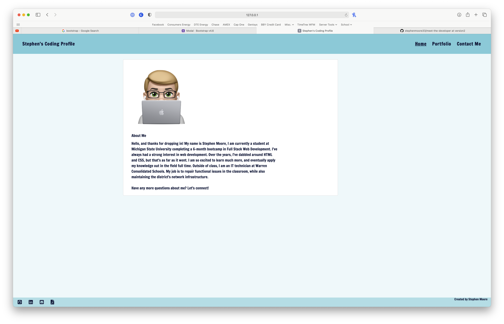
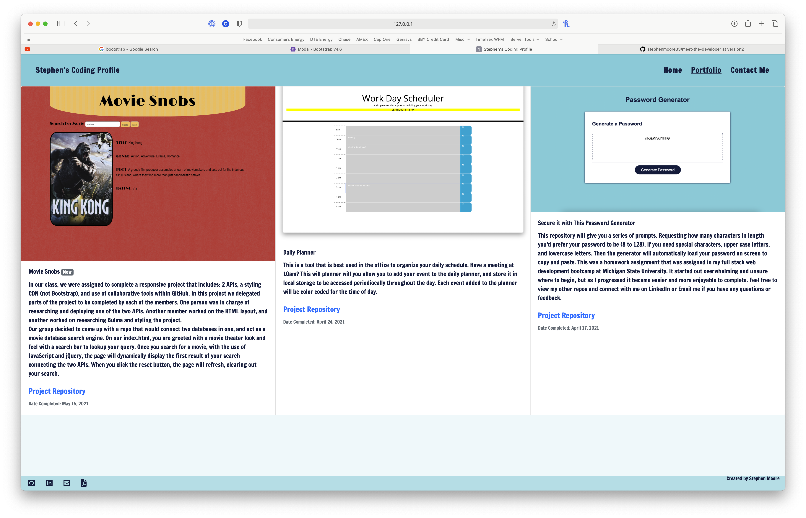
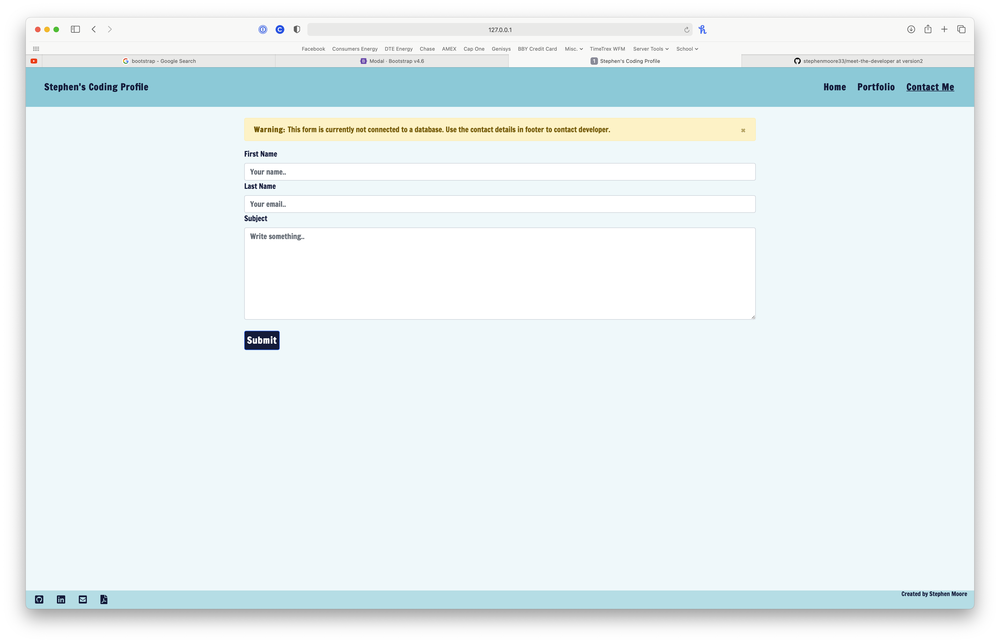

# Meet the Developer

In this project I created a responsive website which includes an about me page, my portfolio, and a page to contact me. At the bottom of the page, I also added links to reach me via email, GitHub, and LinkedIn.

## Table of Contents

- Home Page
- Portfolio
- Contact Me

## Sources
 - [Coolors.co](https://coolors.co/61a0af-96c9dc-f06c9b-f9b9b7-f5d491)
 - [W3 Schools](https://www.w3schools.com/html/html5_semantic_elements.asp)
 - [Font Awesome](https://www.w3schools.com/html/html5_semantic_elements.asp)
 - [BootStrap](http://getbootstrap.com/)

**Home Page**

**Portfolio Page**

**Contact Page**

**Website:**
https://stephenmoore33.github.io/meet-the-developer/
